<div align="center">

# 🎭 Learning Playwright Fundamentals

### *A hands-on, lab-by-lab journey into modern end-to-end test automation with Playwright + TypeScript*

[](../../actions)


> *“From `npx playwright test` to a multi-context, session-cached, Allure-reported, CI-running framework — one numbered lab at a time.”*

</div>

---

## 📚 Table of Contents

1. [Overview](#-overview)
2. [Learning Roadmap](#-learning-roadmap)
3. [Architecture & Mental Model](#-architecture--mental-model)
4. [Project Structure](#-project-structure)
5. [Quick Start](#-quick-start)
6. [Topics Covered (Lab by Lab)](#-topics-covered-lab-by-lab)
   - [01 — Basics](#01--basics)
   - [02 — First Tests (Browser / Context / Page)](#02--first-tests-browser--context--page)
   - [03 — Locators & Commands](#03--locators--commands)
   - [04 — Session Storage](#04--session-storage)
   - [05 — Allure Reporting](#05--allure-reporting)
   - [06 — Multiple Elements](#06--multiple-elements)
   - [07 — Web Tables](#07--web-tables)
   - [08 — Select / Dropdowns / Frames](#08--select--dropdowns--frames)
   - [09 — Frames & Iframes](#09--frames--iframes)
   - [10 — Keyboard, Hover, Drag & Drop, Right Click](#10--keyboard-hover-drag--drop-right-click)
   - [11 — JS Alerts / Confirms / Prompts](#11--js-alerts--confirms--prompts)
   - [12 — Handling SVG Elements](#12--handling-svg-elements)
   - [Projects — TTA Bank E2E](#projects--tta-bank-e2e)
7. [Locator Strategy Cheat Sheet](#-locator-strategy-cheat-sheet)
8. [Wait Strategies (`waitUntil`)](#-wait-strategies-waituntil)
9. [Reporting](#-reporting)
10. [CI / CD Workflow](#-ci--cd-workflow)
11. [Quick Git Workflow (`go.sh`)](#-quick-git-workflow-gosh)
12. [Configuration Reference](#-configuration-reference)
13. [Resources](#-resources)

---

## 🎯 Overview

This repository is the companion code for a structured **Playwright + TypeScript** course taught by **The Testing Academy**. Each lab is numbered (`Lab209`, `211`, `212` … `233`) so the progression maps 1:1 to the curriculum.

You will move through the four classic stages of automation maturity:

```mermaid
flowchart LR
    A[🍼 Hello World<br/>Lab 209] --> B[🧠 Browser/Context/Page<br/>Labs 211–218]
    B --> C[🎯 Locators & Navigation<br/>Labs 219–227]
    C --> D[🔐 Session Reuse<br/>Labs 228–229]
    D --> E[📊 Reporting<br/>Lab 230]
    E --> F[📑 Multi-element / Tables<br/>Labs 231–234]
    F --> H[🎚 Selects / Dropdowns / Frames<br/>Labs 234–238]
    H --> I[🪟 Iframes<br/>Labs 239–241]
    I --> J[⌨️ Keyboard / Hover / DnD<br/>Labs 242, 244–247]
    J --> K[🔔 JS Alerts<br/>Lab 243]
    K --> L[🖼 SVG Elements<br/>Labs 248–250]
    L --> G[🏦 Real Project<br/>TTA Bank]

    style A fill:#fef3c7,stroke:#f59e0b,color:#000
    style G fill:#d1fae5,stroke:#10b981,color:#000
```

---

## 🗺 Learning Roadmap

| Stage | Module | Labs | What You Master |
|:-----:|:-------|:----:|:----------------|
| 1 | `01_Basics` | 209–210 | First test, annotations (`skip`, `only`, `fail`, `slow`) |
| 2 | `02_first_tests` | 211–218 | Browser → Context → Page hierarchy, multi-tab, multi-user |
| 3 | `03_Locators_Commands` | 219–227 | `goto` options, locators (CSS / XPath / Role), cookies |
| 4 | `04_Session_Storage` | 228–229 | `storageState` — login once, reuse session forever |
| 5 | `05_Allure_Reporting` | 230 | Allure annotations: epic → feature → story |
| 6 | `06_Multiple_Element_` | 231 | `allInnerTexts`, iterating collections |
| 7 | `07_WebTables` | 232–234 | Static + dynamic HTML table extraction, employee management |
| 8 | `08_Web_Select_Frames_Iframe` | 234–238 | Native + custom + React-Select dropdowns, async/grouped/creatable |
| 9 | `09_Frame_Iframe` | 239–241 | `frameLocator`, multi-frame pages, nested iframe-in-iframe |
| 10 | `10_Keyboard_Hover_Drag_Drop` | 242, 244–247 | `page.keyboard`, hover menus, `dragTo` + manual mouse DnD, right-click context menus |
| 11 | `11_JS_Alerts` | 243 | `page.on('dialog')` — alert / confirm / prompt accept + dismiss |
| 12 | `12_Handle_SVG` | 248–250 | SVG namespace — click shapes, iterate `.bar` nodes, read attributes |
| 13 | `Projects/Project_4_TTA_BANK` | Task1 | Full E2E flow: signup → transfer → verify balance |

---

## 🧠 Architecture & Mental Model

### The Browser → Context → Page Hierarchy

Playwright's golden rule: **one Browser, many Contexts, many Pages**. Each Context is an *isolated* incognito-like profile — its own cookies, its own `localStorage`, its own user.

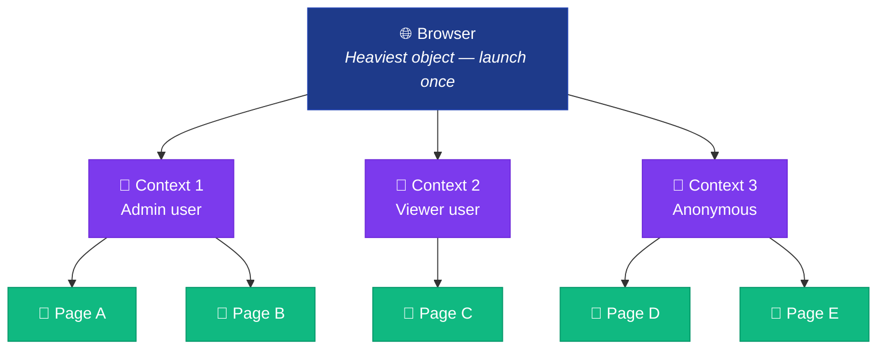

| Object | Cost | Isolation | Use |
|:-------|:----:|:---------:|:----|
| `Browser` | 🐢 Slow | None | Launch **once** per test run |
| `Context` | ⚡ Fast | Full (cookies / storage) | One **per user role** or **per test** |
| `Page` | 🚀 Instant | Shares context | Tabs inside the same logical session |

### How a Playwright Test Actually Runs

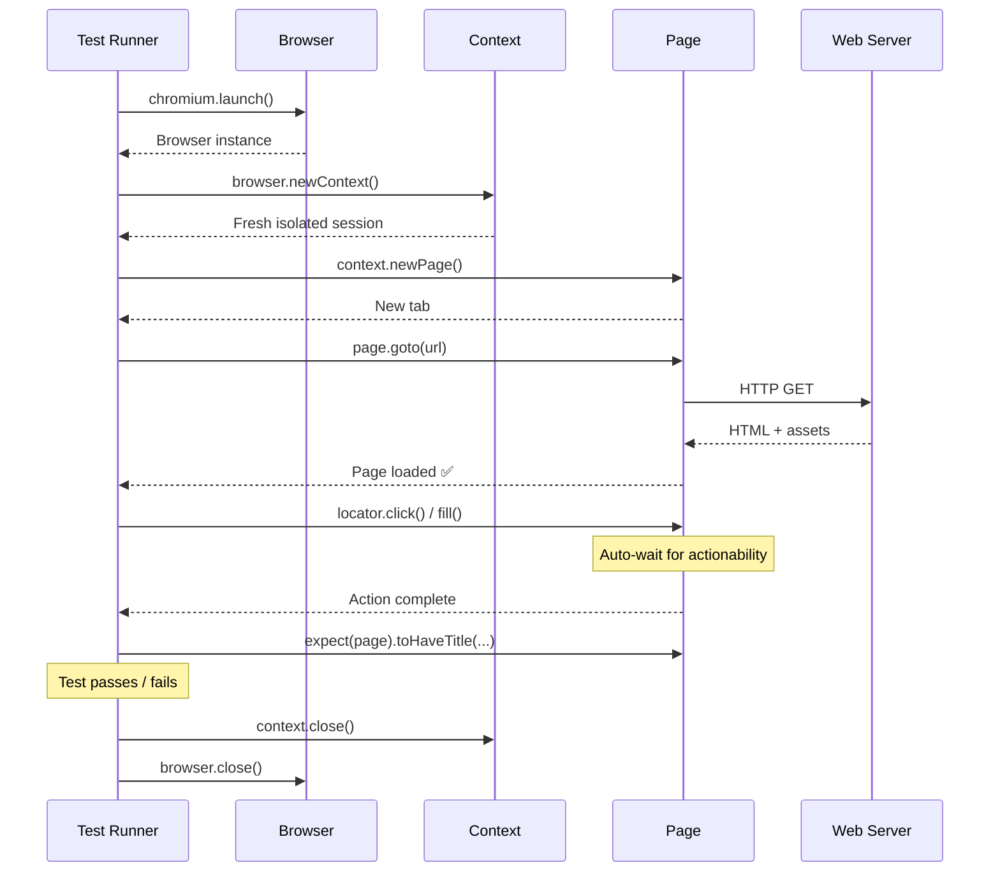

### Locator Resolution — Lazy, Strict, Auto-Waiting

```mermaid
flowchart TD
    A[page.locator&#40;'#login'&#41;] --> B{Locator created<br/><i>nothing happens yet — lazy</i>}
    B --> C[await locator.click&#40;&#41;]
    C --> D{Auto-wait until<br/>element actionable}
    D -->|✅ Visible| E{Strict check —<br/>exactly 1 match?}
    D -->|⏳ Timeout 30s| F[❌ TimeoutError]
    E -->|Yes| G[🟢 Click executed]
    E -->|>1 match| H[❌ StrictModeViolation]

    style B fill:#fef3c7,stroke:#f59e0b,color:#000
    style G fill:#d1fae5,stroke:#10b981,color:#000
    style F fill:#fee2e2,stroke:#ef4444,color:#000
    style H fill:#fee2e2,stroke:#ef4444,color:#000
```

---

## 📁 Project Structure

```
LearningPlaywrightFundamentals/
│
├── tests/
│   ├── 01_Basics/                              # 🍼 Hello-world labs
│   │   ├── Lab209.spec.ts                      # First page.goto + title assertion
│   │   ├── Lab210_Test_Annoations.spec.ts      # skip / only / fail / slow
│   │   └── Util.ts
│   │
│   ├── 02_first_tests/                         # 🧠 Browser / Context / Page
│   │   ├── 211_First_Running_Test.spec.ts
│   │   ├── 212_Browser_Context_Pages.spec.ts   # Manual 3-level launch
│   │   ├── 213_Multile_Context.spec.ts         # Two users in parallel
│   │   ├── 214_Multiple_Pages.spec.ts          # Multi-tab inside one context
│   │   ├── 215_TEST_PW.spec.ts
│   │   ├── 216_Manual_Context.spec.ts
│   │   ├── 217_Manual_Context_Options.spec.ts  # viewport / locale
│   │   └── 218_Context_Reuse.spec.ts           # test.use({...})
│   │
│   ├── 03_Locators_Commands/                   # 🎯 Finding & acting
│   │   ├── 219_Commands.spec.ts                # waitUntil options
│   │   ├── 220_GotoCommands.spec.ts            # goto + referer
│   │   ├── 221_Reffer_Command.spec.ts          # context-level Referer
│   │   ├── 222_Automation.vwo.com.spec.ts      # Locator basics
│   │   ├── 223_Xpath.spec.ts                   # XPath
│   │   ├── 224_GetRole.spec.ts                 # getByRole (accessible)
│   │   ├── 225_CSS_Locators.spec.ts            # first / nth / last
│   │   ├── 226_PressSequentially.spec.ts       # realistic typing
│   │   ├── 227_Cookie.spec.ts                  # cookies CRUD
│   │   └── index.html                          # Local practice page
│   │
│   ├── 04_Session_Storage/                     # 🔐 Skip the login
│   │   ├── 228_Session.spec.ts                 # Save → user-session.json
│   │   └── 229.TestVWo.spec.ts                 # Reuse via test.use({ storageState })
│   │
│   ├── 05_Allure_Reporting/                    # 📊 Rich reports
│   │   └── 230_Login.spec.ts                   # epic / feature / story
│   │
│   ├── 06_Multiple_Element_/                   # 📑 Collections
│   │   └── 231_Multiple_Element.spec.ts        # allInnerTexts + iterate
│   │
│   ├── 07_WebTables/                           # 🗂 HTML tables
│   │   ├── 232_WebTable_Basic.spec.ts          # Static, XPath + Native
│   │   ├── 233_WebTable_Dyanamic.spec.ts       # Dynamic structured extraction
│   │   └── 234_WebTABLE_Employe_Management.spec.ts  # 🚧 Employee mgmt scaffold
│   │
│   ├── 08_Web_Select_Frames_Iframe/            # 🎚 Dropdowns / selects / frames
│   │   ├── 234_Web.spec.ts                     # Sibling-axis + :has() row locators
│   │   ├── 235_Select_FramesWeb.spec.ts        # Native <select> via selectOption
│   │   ├── 236_Advacne_Select_Frames2.spec.ts  # Custom div-based dropdowns
│   │   ├── 237_Advacne_Select_Pro.spec.ts      # React-Select: single/multi/creatable/async
│   │   ├── 238_Advance_Select_Pro_v2.spec.ts   # React-Select pro: remove tag / grouped / async
│   │   └── util.ts                             # selectValue() helper
│   │
│   ├── 09_Frame_Iframe/                        # 🪟 frameLocator API
│   │   ├── 239_Iframe.spec.ts                  # Single iframe — form fill inside frame
│   │   ├── 240_Multiple_frame.spec.ts          # Multi-frame page (frameset) traversal
│   │   └── 241_Iframe_within_Iframe.spec.ts    # Nested frames — pact1 → pact2 → pact3
│   │
│   ├── 10_Keyboard_Hover_Drag_Drop/            # ⌨️ Low-level input APIs
│   │   ├── 242_keyboard.spec.ts                # keyboard.press / down / up + screenshots
│   │   ├── 244_Spicejet_Hover.spec.ts          # hover() to reveal submenu
│   │   ├── 245_Drag_Drop.spec.ts               # dragTo() — the-internet demo
│   │   ├── 246_Drag_Drop_advance_Kanban.spec.ts # Manual mouse.move/down/up for finicky DnD libs
│   │   └── 247_RightClick.spec.ts              # click({ button: 'right' }) + context menu
│   │
│   ├── 11_JS_Alerts/                           # 🔔 Native browser dialogs
│   │   └── 243_JS_Alerts.spec.ts               # alert / confirm / prompt — accept + dismiss
│   │
│   ├── 12_Handle_SVG/                          # 🖼 SVG namespace shapes
│   │   ├── 248_SVG_Project.spec.ts             # Flipkart — click SVG search icon, read results
│   │   ├── 249_SVG_Practice.spec.ts            # TTA widget — click circle / bar / radio shapes
│   │   └── 250_Advance_SVG_pROJECT.spec.ts     # 🚧 Advanced SVG scaffold
│   │
│   └── Projects/
│       └── Project_4_TTA_BANK/
│           └── Task1.spec.ts                   # 🏦 Signup → Transfer → Verify
│
├── utils/
│   └── CustomTTAReporter.ts                    # Custom HTML report → ./tta-report
│
├── .github/workflows/
│   └── playwright.yml                          # CI: Ubuntu + Node LTS + artifacts
│
├── playwright.config.ts                        # FullHD, headed, trace=on, allure
├── package.json                                # npm scripts: test / report / go
├── go.sh                                       # One-shot stage → commit → push
├── user-session.json                           # Saved storage state (Lab 228)
└── README.md                                   # ← you are here
```

---

## 🚀 Quick Start

### 1. Prerequisites

- **Node.js** — LTS version
- **npm**
- macOS / Linux / Windows

### 2. Install

```bash
git clone <this-repo>
cd LearningPlaywrightFundamentals

npm install                  # Install deps
npx playwright install       # Download Chromium / Firefox / WebKit binaries
```

### 3. Run

```bash
npm test                     # 🏃 All tests, Chromium only (config'd)
npm run test:headed          # 👀 Watch the browser
npm run test:ui              # 🖥 Open Playwright's interactive UI
npm run report               # 📈 Open the HTML report
npm run report:tta           # 🎓 Open the custom TTA report
```

### 4. Run a single lab

```bash
npx playwright test tests/01_Basics/Lab209.spec.ts
npx playwright test tests/03_Locators_Commands/   # entire folder
npx playwright test -g "Helen Bennett"            # by test name
```

---

## 📖 Topics Covered (Lab by Lab)

### 01 — Basics

| Lab | File | Concept |
|:---:|:-----|:--------|
| 209 | `Lab209.spec.ts` | First test: `page.goto` + `expect(page).toHaveTitle(...)` |
| 210 | `Lab210_Test_Annoations.spec.ts` | `test.skip` / `.only` / `.fail` / `.slow` + conditional skip per browser |

```ts
test('has title', async ({ page }) => {
    await page.goto('https://playwright.dev/');
    await expect(page).toHaveTitle(/Playwright/);
});
```

---

### 02 — First Tests (Browser / Context / Page)

The heart of Playwright's architecture. Two ways to use it:

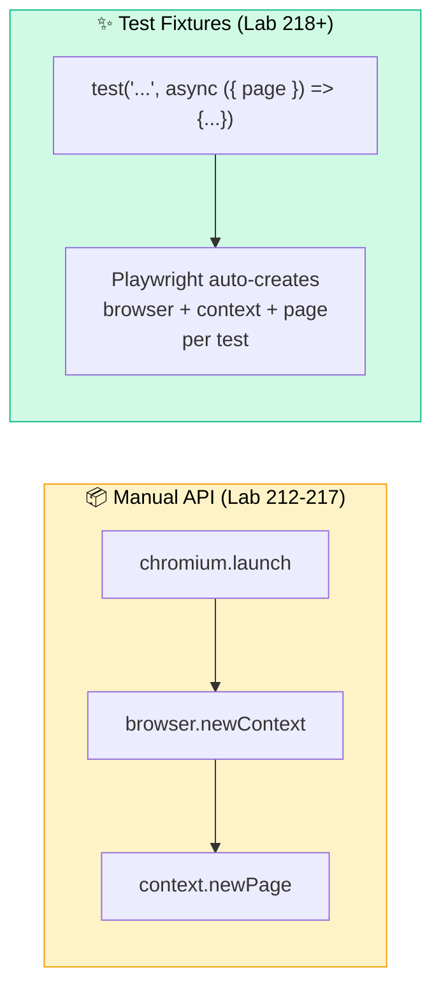

| Lab | Demonstrates |
|:---:|:-------------|
| 212 | Manual 3-level launch with explicit cleanup (`page.close → context.close → browser.close`) |
| 213 | **Two users in parallel** — Admin context + Viewer context, fully isolated |
| 214 | **Multiple tabs in one context** — Tab 2 inherits Tab 1's cookies |
| 216–217 | `browser.newContext({ viewport, locale, extraHTTPHeaders })` |
| 218 | `test.use({ viewport, locale })` to apply config to every test in a `describe` |

---

### 03 — Locators & Commands

#### `page.goto()` Wait Strategies (Lab 219)

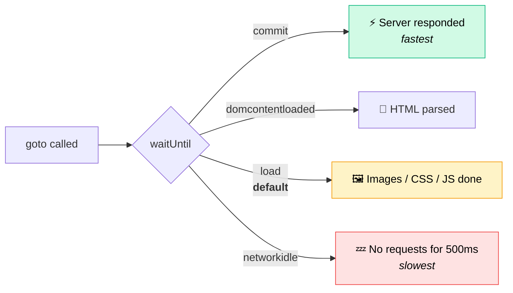

#### Locator Family (Labs 222–227)

| Lab | Locator | Example | When to Use |
|:---:|:--------|:--------|:-----------|
| 222 | `page.locator('#id')` | `page.locator('#login-username')` | Stable IDs / classes |
| 223 | XPath | `page.locator('xpath=//div[@class="x"]')` | Complex DOM traversal |
| 224 | `getByRole` ✨ | `page.getByRole('link', { name: 'Make Appointment' })` | **Accessibility-first, recommended** |
| 225 | CSS + index | `allSpans.first()` / `.nth(2)` / `.last()` | Lists / collections |
| 226 | `pressSequentially` | `field.pressSequentially("hi", { delay: 200 })` | Realistic typing (triggers JS listeners) |
| 227 | Cookies | `context.cookies()` / `context.addCookies([...])` | Programmatic auth |

#### Three Properties Every Locator Has

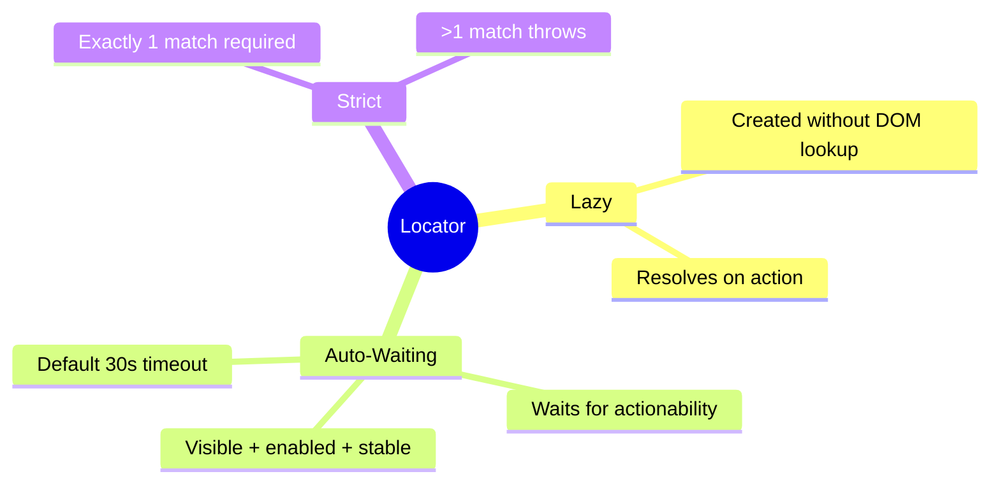

---

### 04 — Session Storage

> *"Why log in 50 times when you can log in once?"*

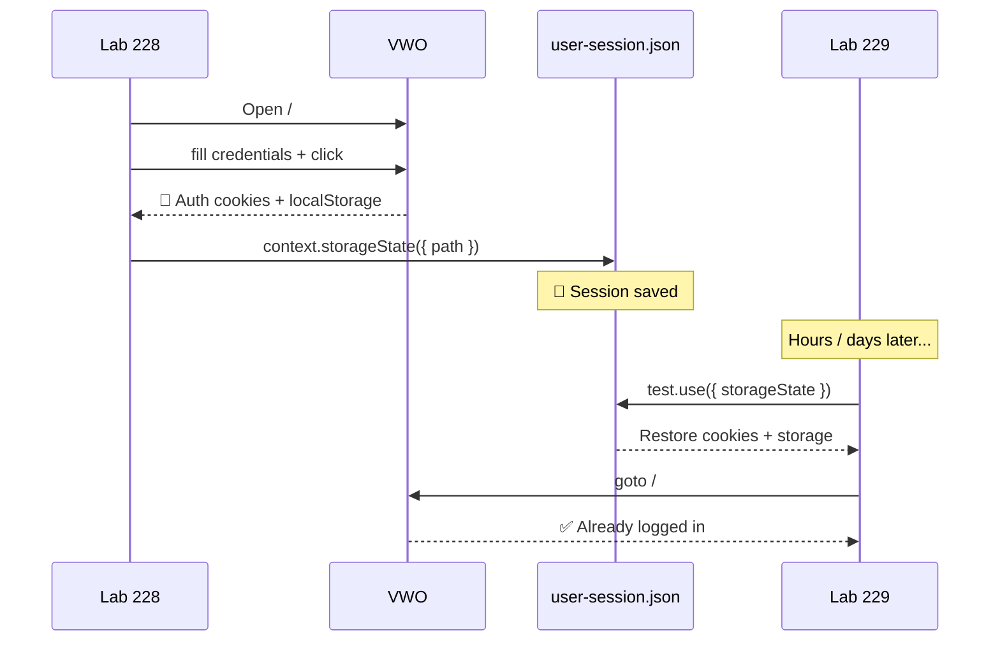

| Lab | Action |
|:---:|:-------|
| 228 | Performs login → calls `context.storageState({ path: './user-session.json' })` |
| 229 | `test.use({ storageState: './user-session.json' })` → jumps **directly** to authenticated pages |

---

### 05 — Allure Reporting

Rich, hierarchical test reports with screenshots, videos and traces.

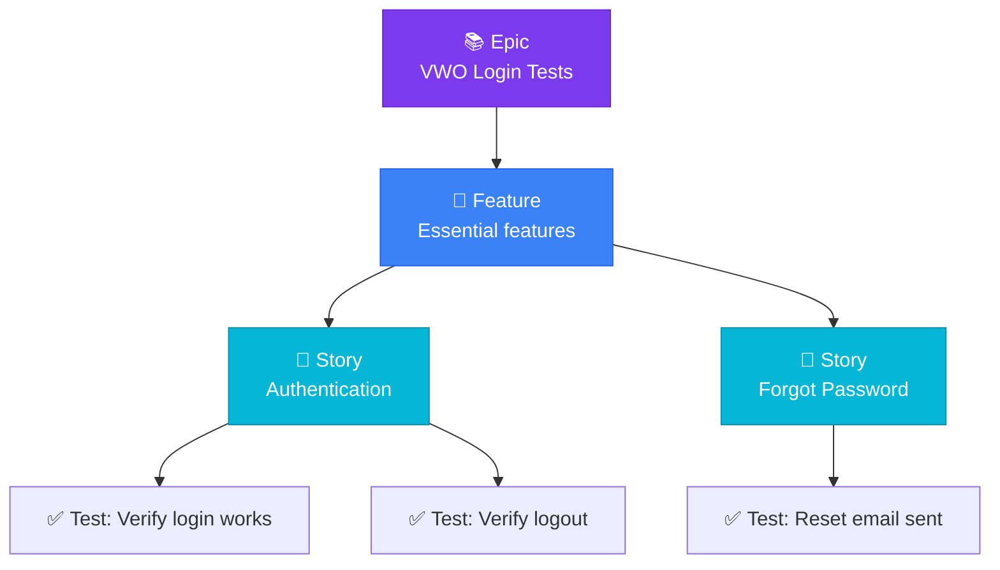

```ts
await allure.epic("VWO Login Tests");
await allure.feature("Essential features");
await allure.story("Authentication");
await allure.description("Verify that the login page works");
```

Open the report:

```bash
npx allure generate ./allure-results --clean -o ./allure-report
npx allure open ./allure-report
```

---

### 06 — Multiple Elements

Lab 231 — work with **collections** of locators:

```ts
const links = page.locator('a.list-group-item');
const texts: string[] = await links.allInnerTexts();   // 🆕 plural
const all     = await links.all();                     // Locator[]
const count   = await links.count();
for (const link of all) {
    console.log(await link.getAttribute("href"));
}
```

| Method | Returns | Use Case |
|:-------|:--------|:---------|
| `.count()` | `number` | How many matches? |
| `.first()` / `.last()` / `.nth(i)` | `Locator` | Pick one |
| `.all()` | `Locator[]` | Iterate with `for…of` |
| `.allInnerTexts()` | `string[]` | All visible text in one shot |
| `.allTextContents()` | `string[]` | Includes hidden text |

---

### 07 — Web Tables

Two flavours of table automation:

#### Static (Lab 232)

Two strategies in one file — XPath template **and** Playwright's native `hasText` filter:

```ts
// 🛠 XPath template — old-school, still useful
const path = `//table[@id="customers"]/tbody/tr[${i}]/td[${j}]`;

// ✨ Native Playwright — recommended
const row = page.locator('#customers tbody tr', { hasText: 'Helen Bennett' });
const country = await row.locator('td').nth(2).innerText();
```

#### Dynamic (Lab 233)

```ts
const rows = page.locator('table[summary="Sample Table"] tbody tr');
const rowCount = await rows.count();
for (let i = 1; i <= rowCount; i++) {
    const rowData = await rows.nth(i).locator('td').allInnerTexts();
    console.log(`Row ${i + 1}:`, rowData);
}
```

```mermaid
flowchart LR
    A[Locate &lt;table&gt;] --> B[Count rows]
    B --> C{Loop rows}
    C --> D[Filter by text<br/>or index]
    D --> E[Read cell with<br/>td:nth&#40;n&#41;.innerText]
    E --> F[Assert / collect data]
```

> Lab **234** (`234_WebTABLE_Employe_Management.spec.ts`) is a placeholder for the upcoming **Employee Management** end-to-end exercise — covering CRUD over a dynamic table with row filtering and inline edits.

---

### 08 — Select / Dropdowns / Frames

Real-world apps rarely use plain `<select>`. This module walks through **three flavours of "dropdown"** and shows the right Playwright pattern for each.

```mermaid
flowchart TD
    Q{Dropdown type?} -->|Native &lt;select&gt;| N[selectOption&#40;value&#41;]
    Q -->|Custom div + onclick<br/>e.g. TTA app| C[click trigger →<br/>getByText option]
    Q -->|React-Select / Headless UI| R[click → search →<br/>getByRole&#40;'option'&#41;]

    style N fill:#d1fae5,stroke:#10b981,color:#000
    style C fill:#fef3c7,stroke:#f59e0b,color:#000
    style R fill:#dbeafe,stroke:#3b82f6,color:#000
```

| Lab | File | Demonstrates |
|:---:|:-----|:-------------|
| 234 | `234_Web.spec.ts` | XPath sibling-axis (`preceding-sibling::td/input`) + `tr:has(td:text('...'))` row filter |
| 235 | `235_Select_FramesWeb.spec.ts` | Native `<select>` via `page.selectOption()` on `the-internet.herokuapp.com` |
| 236 | `236_Advacne_Select_Frames2.spec.ts` | Custom **div-based** dropdowns — click trigger then `getByText({ exact: true })` |
| 237 | `237_Advacne_Select_Pro.spec.ts` | **React-Select**: single, multi (with `Escape`), creatable tags, async typeahead |
| 238 | `238_Advance_Select_Pro_v2.spec.ts` | React-Select **pro**: remove a chosen tag, pick from a *grouped* section, search-then-pick async |
| — | `util.ts` | Reusable `selectValue(page, label, value)` helper for label-driven dropdowns |

#### React-Select Pattern (Lab 237 / 238)

```ts
// Single, searchable
await page.getByTestId('rs-single').click();
await page.getByTestId('rs-single-input').fill('play');
await page.getByRole('option', { name: 'Playwright' }).click();

// Multi — pick three
for (const name of ['Playwright', 'Pytest', 'TestNG']) {
    await page.getByTestId('rs-multi').click();
    await page.getByRole('option', { name }).click();
}

// Async — wait for results to come back from the server
await page.getByTestId('rs-async-input').fill('pun');
await expect(page.getByTestId('rs-async-menu')).toContainText('Pune');
await page.getByRole('option', { name: 'Pune' }).click();
```

#### When to Use Which Dropdown API

| Widget | Detect | Use |
|:-------|:-------|:----|
| `<select>` | Inspect → `<select>` tag | `page.selectOption(selector, value)` |
| Custom CSS dropdown | Click reveals `<div role="listbox">` | `click trigger` → `getByText(option, { exact: true })` |
| React-Select / Combobox | `role="combobox"` + `role="option"` | `click` → `fill` → `getByRole('option', { name })` |

---

### 09 — Frames & Iframes

`frameLocator` is Playwright's window into `<iframe>` content. Treat it like a mini-page — chain `.locator()` calls from it.

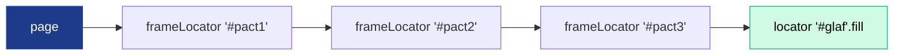

| Lab | File | Demonstrates |
|:---:|:-----|:-------------|
| 239 | `239_Iframe.spec.ts` | Single iframe — fill vehicle-registration form inside `#frame-one` |
| 240 | `240_Multiple_frame.spec.ts` | Frameset page — enumerate `<frame>` elements, drive `main` + `side` independently |
| 241 | `241_Iframe_within_Iframe.spec.ts` | Nested iframes — `frame1.frameLocator(frame2).frameLocator(frame3)` |

```ts
const carFrame = page.frameLocator('#frame-one');
await carFrame.locator('#RESULT_TextField-1').fill('Hyundai i10');
await carFrame.getByText('Submit registration', { exact: true }).click();
```

---

### 10 — Keyboard, Hover, Drag & Drop, Right Click

Low-level input APIs for things `click()` and `fill()` cannot express.

| Lab | API | Scenario |
|:---:|:----|:---------|
| 242 | `page.keyboard.press / down / up` | Type single keys, modifiers (`Shift+O`), arrow keys |
| 244 | `locator.hover()` | Reveal hidden submenus (SpiceJet Add-ons, TTA hover-menu widget) |
| 245 | `source.dragTo(target)` | Classic `the-internet.herokuapp.com/drag_and_drop` swap |
| 246 | `mouse.move / down / up` | Kanban DnD — manual mouse path with `steps: 10` for libs that ignore `dragTo` |
| 247 | `click({ button: 'right' })` | Trigger context menu, read all options, pick `Copy` |

```ts
// Lab 246 — manual mouse path for libraries that swallow dragTo()
const sBox = (await source.boundingBox())!;
const tBox = (await target.boundingBox())!;
await page.mouse.move(sBox.x + sBox.width / 2, sBox.y + sBox.height / 2);
await page.mouse.down();
await page.mouse.move(tBox.x + tBox.width / 2, tBox.y + tBox.height / 2, { steps: 10 });
await page.mouse.up();
```

```mermaid
flowchart TD
    Q{DnD library cooperative?} -->|Yes| A[source.dragTo&#40;target&#41;]
    Q -->|No — React DnD / HTML5| B[mouse.move → down → move steps → up]

    style A fill:#d1fae5,stroke:#10b981,color:#000
    style B fill:#fef3c7,stroke:#f59e0b,color:#000
```

---

### 11 — JS Alerts / Confirms / Prompts

Native browser dialogs **block the page** — you cannot click them with a locator. Register a one-shot `dialog` handler **before** the action that triggers it.

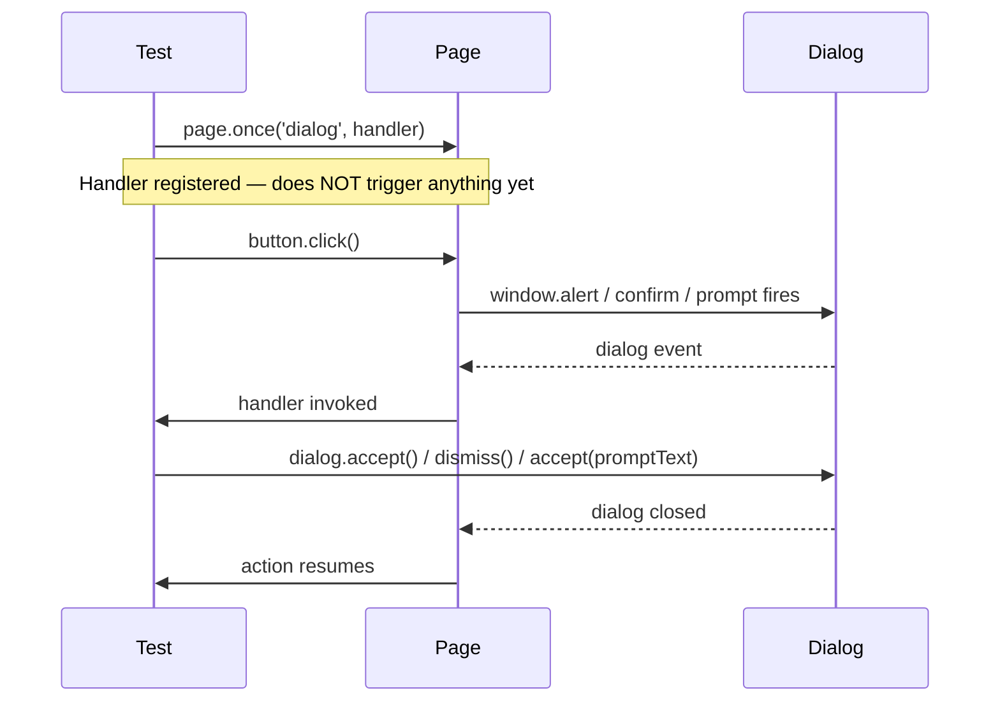

```ts
test('JS Confirm accept', async ({ page }) => {
    page.once('dialog', async dialog => {
        expect(dialog.type()).toBe('confirm');
        expect(dialog.message()).toBe('I am a JS Confirm');
        await dialog.accept();   // or dialog.dismiss()
    });
    await page.locator('button', { hasText: 'Click for JS Confirm' }).click();
    await expect(page.locator('#result')).toHaveText('You clicked: Ok');
});
```

| Dialog Type | API | Notes |
|:------------|:----|:------|
| `alert` | `dialog.accept()` | No return value |
| `confirm` | `accept()` / `dismiss()` | Maps to `Ok` / `Cancel` |
| `prompt` | `accept('text')` / `dismiss()` | Pass text into `accept` |

> ⚠️ Use `page.once` not `page.on` — otherwise the handler stays alive across tests and swallows future dialogs.

---

### 12 — Handling SVG Elements

SVG nodes live in their own namespace — but Playwright treats them like any DOM node. CSS selectors and `getByRole` work out of the box. XPath needs `name()` / `local-name()` because tags are namespaced (`svg:path`).

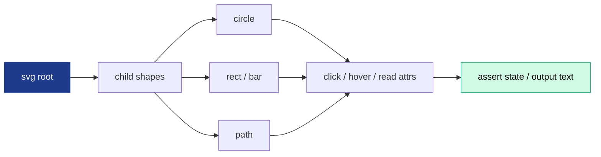

| Lab | File | Demonstrates |
|:---:|:-----|:-------------|
| 248 | `248_SVG_Project.spec.ts` | Real-world — click Flipkart's SVG search icon, scrape product titles via XPath |
| 249 | `249_SVG_Practice.spec.ts` | TTA widget — click `#circle-blue`, iterate `.bar` nodes, read `data-quarter` |
| 250 | `250_Advance_SVG_pROJECT.spec.ts` | 🚧 Scaffold for advanced SVG scenarios |

```ts
// Click an SVG shape by id, then iterate all bars
const circle = page.locator('#circle-blue');
await circle.click();
expect(await page.locator('#shapes-output').innerText()).toContain('Blue circle');

const bars = await page.locator('.bar').all();
for (const bar of bars) {
    const quarter = await bar.getAttribute('data-quarter');
    await bar.click();
    console.log(quarter);
}
```

| Selector Style | SVG-safe? | Example |
|:---------------|:---------:|:--------|
| CSS `#id` / `.class` | ✅ | `page.locator('#circle-blue')` |
| `getByRole` | ✅ (if `role` attr present) | `page.getByRole('button', { name: /Q3 bar/ })` |
| `[data-*]` attr | ✅ | `page.locator('[data-quarter="Q3"]')` |
| XPath plain tag | ❌ | `//path` may not match — use `//*[name()='path']` |

---

### Projects — TTA Bank E2E

The capstone: a **real banking app** at `tta-bank-digital-973242068062.us-west1.run.app`.

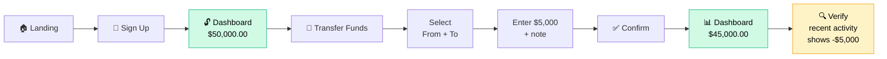

The test file (`Task1.spec.ts`) demonstrates:

- ✅ **TypeScript interfaces** for test data (`SignUpData`, `TransferData`)
- ✅ **Helper functions** (`fillSignUpForm`, `transferFunds`, `confirmTransfer`, `verifyDashboardBalance`)
- ✅ **Accessibility-first locators** (`getByRole`, `getByPlaceholder`, `getByText`)
- ✅ **Multi-step assertions** — heading visible → button visible → balance updated → activity shows debit
- ✅ **Module exports** so helpers can be reused in other spec files

---

## 🎯 Locator Strategy Cheat Sheet

```mermaid
flowchart TD
    Q{What am I locating?} -->|Button / link / heading| R1[✅ getByRole]
    Q -->|Input field| R2[✅ getByLabel / getByPlaceholder]
    Q -->|Visible text| R3[✅ getByText]
    Q -->|Image| R4[✅ getByAltText]
    Q -->|Has data-testid| R5[✅ getByTestId]
    Q -->|Stable id / class| R6[🟡 page.locator&#40;'#id'&#41;]
    Q -->|Complex DOM| R7[🔴 page.locator&#40;'xpath=...'&#41;]

    style R1 fill:#d1fae5,stroke:#10b981,color:#000
    style R2 fill:#d1fae5,stroke:#10b981,color:#000
    style R3 fill:#d1fae5,stroke:#10b981,color:#000
    style R4 fill:#d1fae5,stroke:#10b981,color:#000
    style R5 fill:#d1fae5,stroke:#10b981,color:#000
    style R6 fill:#fef3c7,stroke:#f59e0b,color:#000
    style R7 fill:#fee2e2,stroke:#ef4444,color:#000
```

| Priority | Locator | Resilient to | Demoed in |
|:--------:|:--------|:-------------|:----------|
| 🥇 | `getByRole` | DOM refactors, design changes | Lab 224 |
| 🥈 | `getByLabel` / `getByPlaceholder` | Class renames | Lab 231 |
| 🥉 | `getByText` | Layout changes | Lab 231 |
| 4 | `getByTestId` | All UI changes | TTA Bank |
| 5 | CSS `#id` / `.class` | Visual changes only | Lab 222 |
| 6 | XPath | Almost nothing | Lab 223 |

---

## ⏱ Wait Strategies (`waitUntil`)

| Option | Fires When | Speed | Use For |
|:-------|:-----------|:-----:|:--------|
| `commit` | Server returned headers | 🚀🚀🚀 | API-only checks |
| `domcontentloaded` | HTML parsed (no waiting on images) | 🚀🚀 | SPAs that hydrate later |
| `load` *(default)* | All sub-resources loaded | 🚀 | Most pages |
| `networkidle` | No requests for 500 ms | 🐢 | Heavy AJAX dashboards (use sparingly) |

---

## 📊 Reporting

Three reporters run on **every** test execution (configured in `playwright.config.ts`):

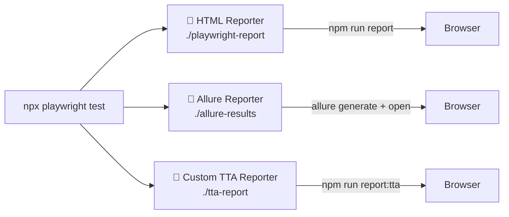

| Reporter | Built-in? | Output | Open Command |
|:---------|:---------:|:-------|:-------------|
| HTML | ✅ | `./playwright-report/index.html` | `npm run report` |
| Allure | npm pkg | `./allure-results` → `./allure-report` | `npx allure open ./allure-report` |
| Custom TTA | `utils/CustomTTAReporter.ts` | `./tta-report/index.html` | `npm run report:tta` |

> The **Custom TTA Reporter** (`utils/CustomTTAReporter.ts`) is hand-written specifically for The Testing Academy's branded report style — a great example of Playwright's pluggable `Reporter` interface.

Every test also captures **on failure and on success** (per config):

- 📹 Video recording
- 📸 Screenshot
- 🔬 Trace file (open with `npx playwright show-trace`)

---

## 🔄 CI / CD Workflow

`.github/workflows/playwright.yml` runs on every push / PR to `main` or `master`:

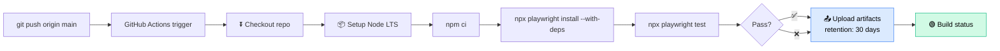

Reports are uploaded as **artifacts** so you can download them from any failed run for 30 days.

---

## ⚡ Quick Git Workflow (`go.sh`)

A one-shot helper at the repo root:

```bash
./go.sh "feat: add lab 234 - drag and drop"
# or
npm run go -- "fix: typo in lab 232"
# or — auto-timestamped commit message
./go.sh
```

What it does:

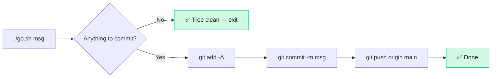

> ⚠️ It stages **all** changes — review with `git status` if unsure.

---

## ⚙️ Configuration Reference

`playwright.config.ts` highlights:

| Setting | Value | Why |
|:--------|:------|:----|
| `testDir` | `./tests` | Standard layout |
| `fullyParallel` | `true` | Speed |
| `retries` | `2` on CI / `0` locally | Catch flakes on CI without slowing dev |
| `reporter` | `[html, allure-playwright, CustomTTAReporter]` | Three views of the same run |
| `headless` | `false` | 👀 Learning is easier when you watch |
| `viewport` | `1920 × 1080` | Full HD — matches real desktops |
| `trace` | `'on'` | Record every action — open with `show-trace` |
| `video` | `'on'` | Per-test recording |
| `screenshot` | `'on'` | Per-step still images |
| `projects` | `chromium` only | Firefox / WebKit commented out — ready to enable |

```mermaid
flowchart TD
    A[playwright.config.ts] --> B[fullyParallel: true]
    A --> C[reporter: 3 reporters]
    A --> D[use: ...]
    D --> E[trace: on]
    D --> F[video: on]
    D --> G[screenshot: on]
    D --> H[viewport 1920x1080]
    D --> I[headless: false]
    A --> J[projects]
    J --> K[✅ chromium]
    J -.commented.-> L[firefox / webkit / mobile]
```

---

## 📚 Resources

- 📘 [Playwright Documentation](https://playwright.dev/docs/intro)
- 📗 [Playwright API Reference](https://playwright.dev/docs/api/class-playwright)
- 📙 [Allure for Playwright](https://www.npmjs.com/package/allure-playwright)
- 🎓 [The Testing Academy](https://thetestingacademy.com)
- 💬 Issues / questions → open a GitHub Issue or email **thetestingacademy@gmail.com**

---

<div align="center">

### 🎭 Built with ❤️ by The Testing Academy

*Happy testing — may your `expect`s always resolve.* ✨

</div>
