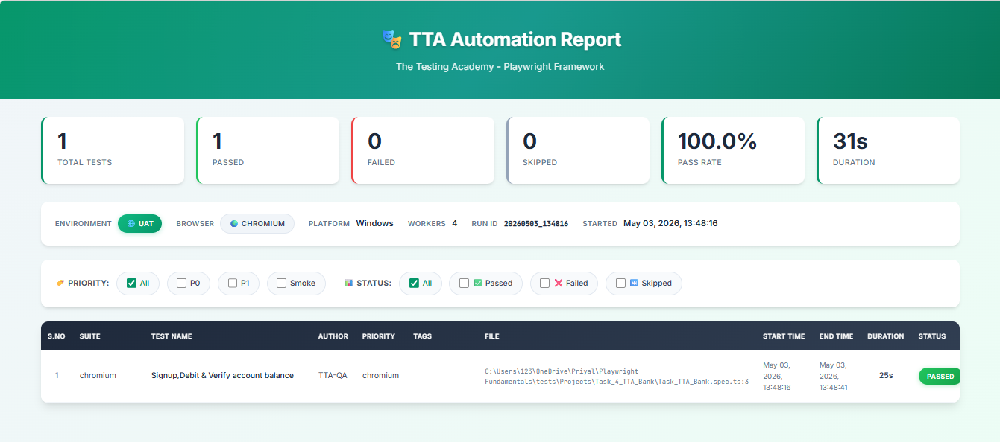
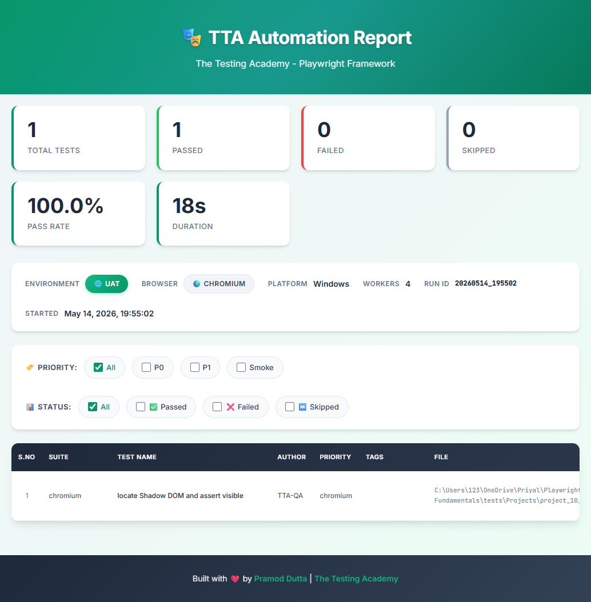

# 🏦 TTA Bank Automation

This project automates the end-to-end user flow for the **TTA Bank** digital application using **Playwright**.

## 📝 Test Scenario: Signup, Debit & Balance Verification

The automation script covers the following critical business flow:
1. **User Registration**: Automates the sign-up process with secure credentials.
2. **Account Creation**: Successfully initializes a new bank account.
3. **Initial Balance Verification**: Confirms the starting balance of **$50,000.00**.
4. **Fund Transfer**: Performs a debit transaction of **$5,000.00** with transaction details.
5. **Final Balance Validation**: Verifies that the remaining balance is correctly updated to **$45,000.00**.

---

## 🚀 Key Features

- **End-to-End Automation**: Complete coverage from signup to transaction verification.
- **Robust Locators**: Uses Playwright's `getByRole` and `getByPlaceholder` for reliable testing.
- **Visual Reporting**: Integrated with a custom TTA reporter for step-by-step visibility.
- **Artifact Collection**: Automatic capture of screenshots and videos for audit trails.

---

## 🏃 How to Run the Test

To execute the TTA Bank automation test:

```bash
npx playwright test tests/Projects/Task_4_TTA_Bank/Task_TTA_Bank.spec.ts
```

---

## 📊 Execution Evidence

### 🎥 Execution Video Preview



### 📊 Execution Report



---

Built with ❤️ by **The Testing Academy**
